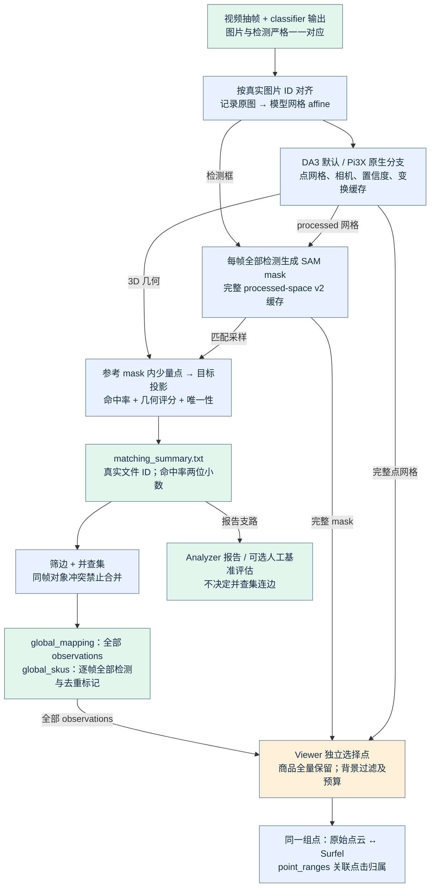
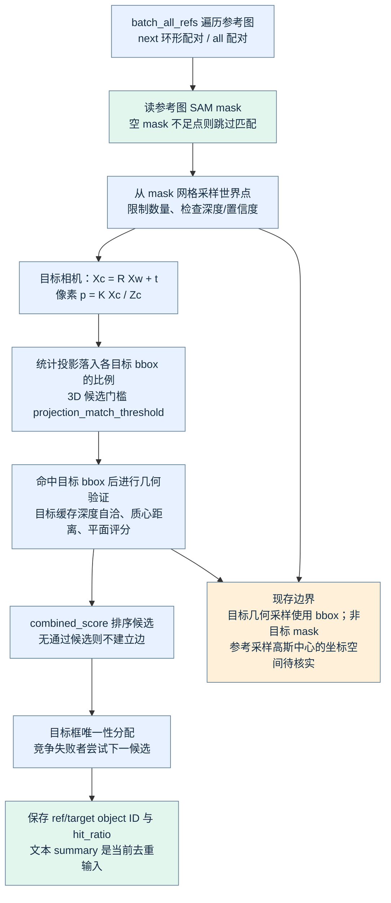
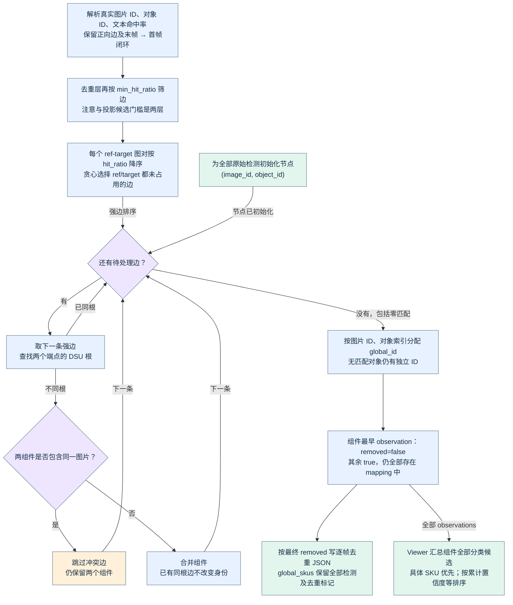
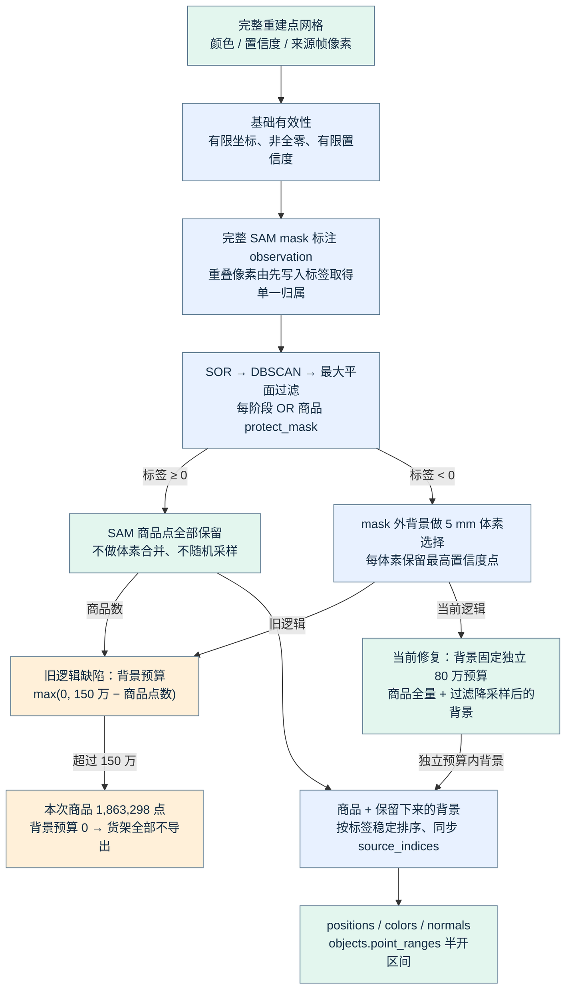
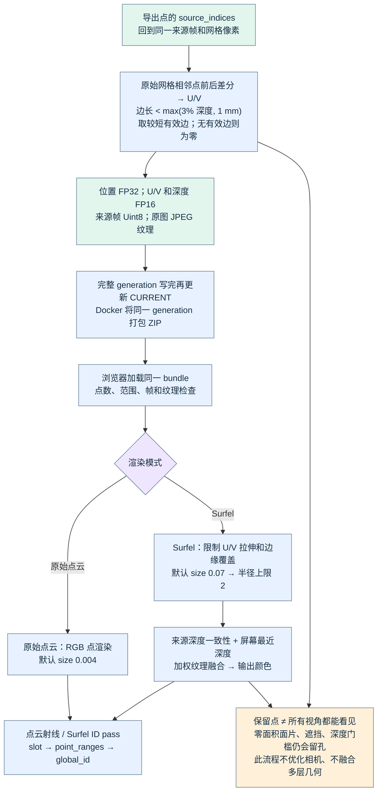

# 当前 3D 去重、点云导出与可视化流程

2026-09-10，依据当前工作区源码与 video3 本地复现。本文描述源码行为；旧 COS ZIP 和正在运行的 Docker 容器不能据此视为已更新。

[打开离线交互流程图](figures/dedup-flowcharts/index.html)：五张图可放大、缩小、下载 SVG，不依赖网络。下文给出同源 Mermaid 图、参数、公式和源码入口。

## 🧭 先区分三种处理

| 处理 | 输入与目的 | 不会做的事 |
|---|---|---|
| 商品身份去重 | 跨帧检测节点与匹配边 → global_id；同一实体只计一次 | 不融合点坐标，不修正相机或深度 |
| Viewer 点选择 | 完整重建点网格 + 全部 observations 的 SAM mask → 可显示点 | 不修改 global_id、匹配边或计数 |
| Surfel 渲染 | 已导出点 + 网格切向量 U/V + 来源纹理 → 连续表面 | 不训练 3DGS，不执行逐场景几何优化 |

`removed=True` 表示该 observation 不重复计数，**不表示它的商品点应删除**。商品的多帧点全部保留后，同一表面的深度偏差和双层几何仍会存在。

## 📥 输入、坐标与重建

1. 视频抽帧在核心去重之前完成，抽帧间隔由上游决定；核心不能通过文件名推断时间。当前 video3 使用 29 帧，对应用户提供的 1.5 秒间隔及 `fd-videos/3.json`。
2. Docker 入口要求图片数组与逐帧 classifier JSON 数量相同，解码检查图片并转换为标准检测结构。按请求顺序写 `images/0.jpg…` 与 `detections_results/0.json…`。原始对象顺序决定 `object_id`。
3. 独立数据集可以有不连续文件 ID。模型缓存、检测、mask 和原图必须按真实 `image_ids` 对齐；数组位置不等于文件 ID。内部 correspondences JSON 保留数组索引及 `image_paths`；文本 summary 输出真实文件 ID。
4. DA3 默认 runner 以 `process_res=504` 和固定预处理方法生成模型网格，记录原图尺寸及 `source_to_processed_affine`。504 不是所有输入都得到 504×504；当前 video3 是宽 504、高 280。不要把原图 bbox 直接当作模型网格 bbox。
5. DA3 推理得到深度、置信度、世界到相机外参和内参。runner 要求 `is_metric=1`，记录尺度字段；实际世界点从返回深度反投影得到。生产调用未启用 `infer_gs`。
6. Pi3X 使用自己的缓存、缩放/裁剪记录和导出分支；不能继承 DA3 的米制证明，也不能把同数值的距离阈值解释成已验证物理米。

坐标公式：`X_camera = D(u,v) · K⁻¹[u,v,1]ᵀ`；`X_world = Rᵀ(X_camera − t)`，其中 `E=[R|t]` 为世界到相机外参。显示端的 `world_to_view` 只用于摆正/居中；来源相机投影仍使用原始世界坐标。

主要缓存字段：`world_points[F,H,W,3]`、`world_points_conf[F,H,W]`、`images[F,H,W,3]`、`image_ids[F]`、相机参数和 affine。重建 GLB 的筛点参数不应当作 Viewer 最终点数规则；Viewer 重新读取完整缓存。

源码：[DA3 runner](../src/da3_runner.py)、[匹配数据加载](../utils/matching_algorithms.py)、[Docker 入口当前工作目录](../runtime/worktrees/mapping-docker-rebuild/processor.py)。

## 🎯 SAM 与逐图对匹配

### SAM 分割缓存

每帧全部原始检测框在处理图上作为各自的正 exemplar；当前 v2 调用使用阈值 0.5、内部图像尺寸 1008、批量最多 32、最高分 Top-1 mask，最后裁剪到框内。不是按 bbox IoU 选择 mask。完整 processed-space mask 缓存同时供匹配与 Viewer 使用；导出阶段不重新推理 SAM。

空分割的现行行为是保留全零 mask并警告，随后采样不足时无法建立匹配；有检测框不保证 SAM 一定覆盖整个物体。缓存文件缺失、对象集合或网格不一致时导出报错，不拿矩形框补出商品几何。

### 匹配采样和投影

参考 mask 内先按高斯权重挑选最多 700 个候选像素（70×10），σ=0.3，归一化距离超过 3σ 的权重为零；过滤后随机保留最多 70 个世界点，至少需要 10 个。**这 70 个点只用于匹配，Viewer 商品点不受此上限约束。**

对目标相机计算 `q=K E [X_world,1]ᵀ`，保留 `q.z>0.1` 的投影，`p=(q.x/q.z,q.y/q.z)`。有效投影少于 5 个跳过。目标框超过 5 个时，先按落框点数取 Top-5；否则所有目标框进入几何验证。

当前目标几何使用目标 bbox 采样，并未使用目标 SAM mask。通常整框一个区域最多取 `int(70×0.3)=21` 点；区域深度自洽点不足 3 时记录可反投影像素；常规采样不足后，仅当存在这些像素时尝试深度反投影，最终仍不足 10 则拒绝。参考 mask 缺失分支现有 bbox 区域采样逻辑，正常完整缓存中的空 mask 则直接产生不足点；本次没有新增或更改这些行为。

### 当前参数和分数

| 参数/门槛 | 当前路径值 | 实际用途 |
|---|---:|---|
| 配对策略 | YAML `next` | i→(i+1)%N，包括末帧到首帧；类默认 `all` 不代表当前运行值 |
| 3D 参考采样上限/下限 | 70 / 10 | `max_3d_points_per_bbox` 与有效点门槛 |
| 深度范围 | (0.3, 8.0) | 匹配采样过滤；不是 Viewer 全量有效性条件 |
| DA3 深度/点置信度 | >1.5 | 匹配采样；Pi3X 默认 >0.05 |
| 投影命中率 r | ≥0.3 | `projection_match_threshold`，3D 候选门槛 |
| 质心距离 d | ≤0.5 | 参考和目标世界点均值的距离 |
| 目标缓存深度自洽 | 差值 <0.3 | `Z(E_target X)` 与目标缓存深度一致性 |
| 去重层命中率 | 通常 ≥0.4 | `deduplicate_sequence` 默认；独立脚本 CLI 默认 0.0，必须看入口 |
| YAML `max_points_per_bbox=50`、`confidence_threshold=0.5`、`min_hit_ratio=0.4` | 点追踪参数 | 不应直接写成当前 3D 采样上限和投影门槛 |

命中率 `r = 落入目标框点数 / 有效投影总点数`。SVD 拟合平面，令 `a=|n_ref·n_target|`、`e=目标平面残差`、`g=max(0,1−d/dmax)`、`c=a·max(0,1−e/dmax)`：有参考平面时 `score=0.5r+0.2g+0.3c`，没有时 `score=0.6r+0.4g`。

当前 `plane_normal_alignment_threshold=0.2` 没有成为硬拒绝条件；法向只参加评分。也没有逐点双向跨视图一致性或全局相机优化。所有候选按组合分数降序进行图像对内贪心唯一性分配：ref、target 都未占用才接受，竞争失败的参考还能尝试下一候选；不是 Hungarian 最优分配。

源码：[SAM 实现](../utils/sam3_utils.py)、[匹配主流程](../utils/matching_algorithms.py)、[几何与唯一性](../utils/geometry_3d.py)、[后端参数模板](../utils/config.py)、[YAML](../config.yaml)。

## 🧩 跨帧身份去重与分类

1. `parse_all_matches` 从 summary 组头读取真实图片 ID，保留正向边与最大 ID→最小 ID 闭环边。非空匹配组要求组头参考/目标 ID 和匹配条数正确；残留未归组匹配报错。后续检查检测文件 ID 和 DSU 边端点是否存在。summary 的 `hit_ratio` 已经格式化为两位小数，后续筛边和排序使用舍入值，不直接使用 JSON 中的全精度。
2. 按去重层命中率门槛筛边，然后每个图像对独立按命中率降序执行 ref/target 唯一性筛选。此处依据命中率，前面匹配阶段依据组合分数，两者不能混同。
3. 所有原始检测都初始化成并查集节点，包括无匹配者。强边优先；合并会使组件出现同一图片的两个检测时拒绝该边；否则连通。孤立检测仍得到独立 `global_id`。
4. 按真实图片 ID、原始对象索引升序遍历，为首次出现的组件分配从 1 开始的 ID。最早 observation 为 `removed=False`，其他为 true。代表不是最清晰图、最大框或最高置信度图。
5. 逐帧去重 JSON 从最终 mapping 的 `removed=False` 重新派生。当前 `any` 和 `best` 构建 gid 均用最佳一对一边，因此最终身份和输出相同；`any` 的宽松删除集合只影响中间状态/日志。此处记录实际行为，不沿用旧注释。

| 产物 | 真实内容 |
|---|---|
| `global_mapping.json` | gid → 全部 observations，含 bbox、image_id、object_id、removed、classification |
| 逐帧去重 JSON | 仅最终代表对象，保留原始检测内容 |
| `global_skus.json` | 按图片组织的 **JSON 字符串列表**；每图全部原始检测附 global_id/is_deduplicated，不是每 gid 一条的统计表 |
| Viewer `objects.json` | 全部 observations 的显示信息、聚合分类、point_ranges；部分无几何对象可有空区间 |

计数以组件或未被去重的代表为准，不能把 `global_skus` 中所有检测直接相加。mapping/global_skus 的发布采用临时文件及逐文件替换、异常清理；并非两个文件或整个目录的单次原子事务。

分类聚合使用同 gid 的全部 observations，跳过 unavailable，按 `(sku_id,sku_name)` 分组。先将 `56642/其他品类` 放到具体 SKU 后，再按置信度和、支持数量、最大置信度降序、身份字典序排序。零候选 unavailable，单候选 resolved，多候选 conflict 但仍给出 primary。它不会重新决定 DSU 连边。

Analyzer 读取 summary、进行图对过滤并产生报告，是独立分析支路。人工基准评估也不决定 gid；当前基准编号为源图片文件 ID+1。

源码：[去重](../src/deduplicate_detections.py)、[文本输出](../utils/visualization.py)、[分类聚合](../utils/classification_aggregation.py)、[对象索引](../utils/global_object_index.py)、[Analyzer](../src/improved_sku_analyzer.py)。

## 🏪 商品全量保留、背景过滤与本次修复

导出基础有效性仅要求坐标有限、不是全零、置信度有限；不是匹配阶段的深度/置信度阈值。先将完整 SAM mask 映射到同一个来源网格，生成 observation 标签。重叠 mask 的一个像素只有一个标签，按 gid 排序后先写入者获得归属；保留的是 mask 并集内全部有效源点，不为重叠标签复制点。

几何过滤按以下顺序执行，每阶段将商品 `protect_mask` OR 回保留集合。商品点参加几何统计但不被这些过滤删除。

| 阶段 | 默认设置与边界 |
|---|---|
| 统计离群 SOR | 邻居 20、标准差倍率 2 |
| DBSCAN | ε=初始点云最近邻距离中位数×5，核心邻居 10；保留占当前点数≥1%的簇，无达标簇则保留最大簇 |
| 最大平面过滤 | RANSAC 1000 次；距离阈值 clip(最近邻中位数×3,0.02,0.15)，平面占比≥8% |
| 平面保护条件 | 其余点在平面两侧均超过15%则跳过删除；**没有地面朝向判定，货架背板等仍可能被误当大平面** |
| 退化保护 | 点数<1000、最近邻中位数≤0时跳过几何过滤；某阶段保留不到当前20%时跳过该阶段 |

过滤后分成商品与背景。商品全部保留，包括同一 gid、多帧、同一体素内的全部有效源点。背景以默认 0.005 网格做体素分组，每体素选择置信度最高者，超预算时用 seed 42 无放回抽样。

**已确认并修复的预算：** `N_final = N_SAM + min(N_background_voxel, 800000)`。背景上限写死为 `MAX_BACKGROUND_POINTS=800_000`，已移除函数 `max_points`、CLI `--max-points` 和 `--viewer-web-max-points`；商品不占用背景预算。此修改不改变离群/聚类/平面过滤，因此不承诺每个原始货架像素都恢复。

此前公式为 `B=max(0,1,500,000−N_SAM)`。video3 有效点 4,092,480、几何过滤后 3,436,638、商品点 1,863,298，导致 B=0，日志明确写出 background=0。这足以解释“物体齐全，但货架消失”，并非浏览器把正常导出的货架隐藏。

合并两支点后稳定按标签排序；positions、colors、标签、source_indices 同步。`point_ranges=[start,end)` 为半开区间。原始点云与 Surfel 共用同一组点；背景保留 label=-1，无商品归属，但仍应参与可见性和遮挡。

源码：[导出 `_sample_points`](../src/web_viewer_export.py)、[场景过滤](../utils/pointcloud_filter.py)。

## 🖼️ Surfel、发布与点击

对完整原始网格沿宽/高计算 U/V。候选前后差分要求邻点有效、来源相机深度正、三维边长 `<max(0.03×depth,0.001)`；取较短有效边，两边无效则该切向量为零。用 source_indices 选出与导出点完全一致的顺序。

| 文件 | 格式 |
|---|---|
| `positions.f32.bin` | FP32 `[P,3]` |
| `colors.u8.bin` / `normals.i8.bin` | RGB Uint8 / 固定占位法向 Int8 `[P,3]`；Surfel 方向来自 U/V |
| `surfel-u.f16.bin`、`surfel-v.f16.bin` | FP16 `[P,3]` |
| `surfel-frame.u8.bin` | 来源帧 Uint8 `[P]` |
| `surfel-depth.f16.bin` | 完整来源深度 FP16 `[F,H,W]`，0 表示无效 |
| `surfel.json`、每帧 JPEG | 相机、逆 affine、网格和纹理尺寸；纹理最长边≤1920、短边≤1080、不放大 |
| `manifest.json`、`objects.json`、缩略图 | 显示变换、对象区间及观察信息；本地静态入口另需主数据 |

CPU 侧像素切向量不等于最终屏幕面片尺寸。shader 对归一化 U/V 的奇异值约束：最大原生拉伸 2、长宽比 4；邻深度不连续处限制到来源像素边界。面片世界点 `p=center+radius×(xU+yV)`，圆盘外片元丢弃。当前 Surfel size=0.07 映射到半径上限 2；点云 size=0.004，两种模式独立存储于当前页面，刷新恢复默认。

来源相机投影后检查有效域、逆 affine、纹理边界及 `|D_source−Z_source|≤0.015 D_source+0.001`。屏幕深度 pass 找最近表面；颜色 pass 仅融合前表面容差 `0.001+0.5×min(|U|,|V|)` 内贡献；线性 RGB 按 `exp(−2(x²+y²))` 累积后归一化。这是屏幕颜色融合，不是世界点融合。

原始点云点击使用射线容差，遇到可见无归属前景即停止，不穿透选择后方商品。Surfel 单独 ID pass 复用可见面片和深度有效性条件，slot 经 point_ranges 找 gid。几何顺序改变后区间必须重算，不能沿用旧包区间。

生成完整临时 generation 后重命名并原子更新 `CURRENT`；Docker 打包同 generation 为 ZIP 后上传 COS。本次修复只本地重新导出，不会覆盖旧 COS 数据或自动更新运行中容器。纹理是完整帧，增加背景点主要增加逐点数组与面片渲染工作，不会相应再增加一套来源照片。

源码：[Surfel 导出](../src/surfel_export.py)、[shader](../modules/viewer_web/src/surfel-renderer.ts)、[场景与交互](../modules/viewer_web/src/scene.ts)、[点选](../modules/viewer_web/src/point-picking.ts)。

## 🔎 当前仍需独立处理的边界

- 并查集只保证每组件每图最多一个检测；错误边仍能把不同实体连在一起，漏边仍会重复计数。gid 是本次运行生成的编号，不是跨任务永久身份。
- 当前参考 SAM 高斯采样传入 `mask_space="final"`，同时传原图 bbox；高斯中心可能与 processed mask 不在同一坐标系。该潜在问题已从调用链发现，尚未通过针对性实验验证影响，本次没有修改匹配算法。
- 目标几何采用 bbox，不采用目标 mask；未启用真正的多视图几何一致性融合。商品完整不等于轮廓、深度和归属都已正确。
- 背景独立预算修复“预算归零”，但最大平面过滤仍可能删除背板，聚类也可能删除细杆。应在恢复后的画面有明确局部缺失时再定位具体过滤阶段。
- 零面积 U/V、深度门槛、遮挡及视角空白仍可能导致 Surfel 孔洞；全量 SAM 点可以在原始点云中存在但不生成可见 Surfel 像素。

流程图以当前真实路径为准，额外发现仅列为边界，未在本次预算修复中扩大改动范围。

## ✅ 前次 150 万背景预算的恢复验证（历史结果）

复用同一 video3 重建与 SAM 缓存，只重新导出：商品点 **1,863,298**、背景点 **1,164,481**、总点数 **3,027,779**。背景上限是 150 万，不会补造到 150 万；过滤及体素降采样后只有这些候选。逐 gid 商品坐标和 observations 与修复前包完全一致。

- 定向回归：`test/test_viewer_mask_retention.py`，3 passed；修复前两个预算用例失败。
- 浏览器：Surfel、原始点云加载，独立 size 切换恢复，Surfel 点击通过，页面错误为零。
- [恢复背景后的 Viewer](http://192.168.2.6:5173/?data=/data-audit-video3-sam-background/)。
- 本地验证记录：`runtime/dedup-flowcharts/export-result.json`、`browser-smoke.json`。未重跑模型、未上传 COS、未更新运行中 Docker。

## ✅ 当前固定 80 万背景点结果

商品 1,863,298 点保持不变，背景 800,000 点，总计 2,663,298 点；按 Docker 当前 ZIP_STORED 打包方式为 109,742,892 bytes（109.74 MB）。逐 gid 商品坐标及 observations 比较通过，5项定向测试通过。背景几何过滤含 RANSAC，重导出背景候选不保证与历史运行完全相同；本次没有修改过滤策略。

[打开当前 80 万背景点 Viewer](http://192.168.2.6:5173/?data=/data-audit-video3-sam-background-800k/)。未上传 COS、未替换运行中 Docker 容器。
